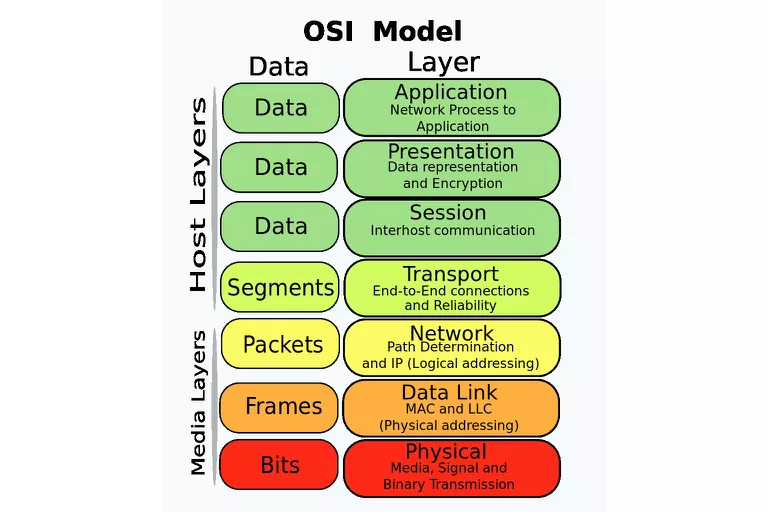
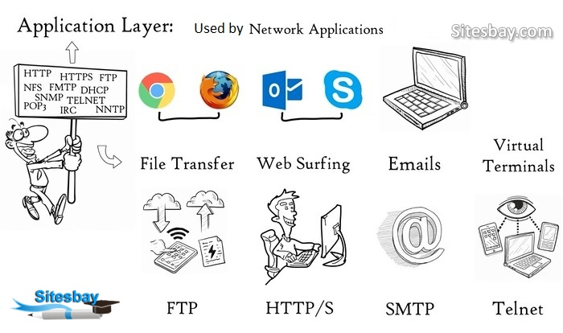
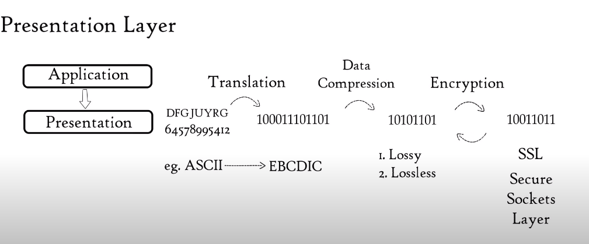
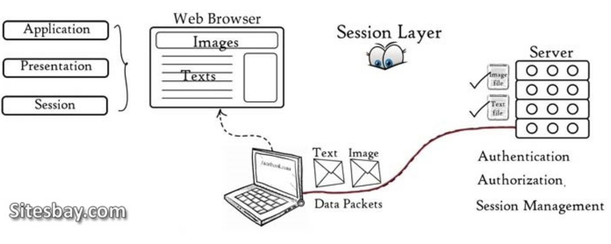
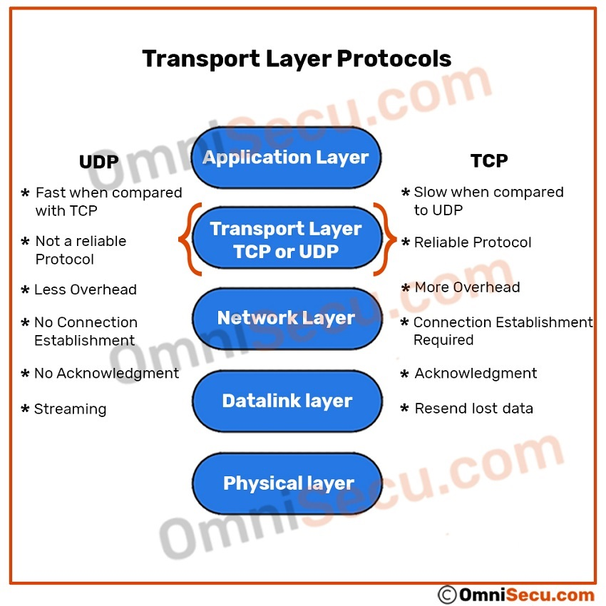
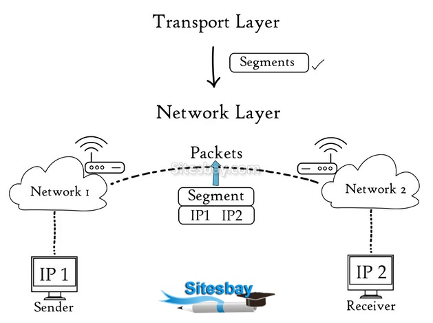
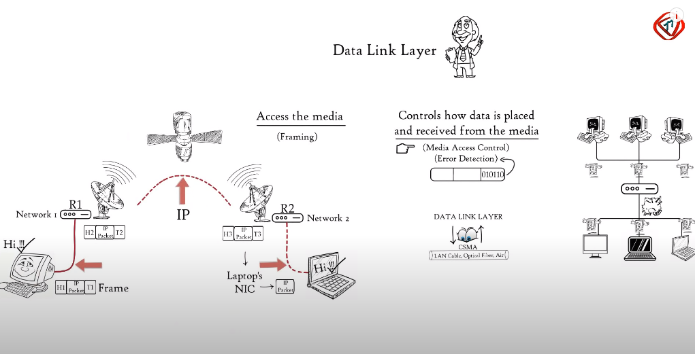
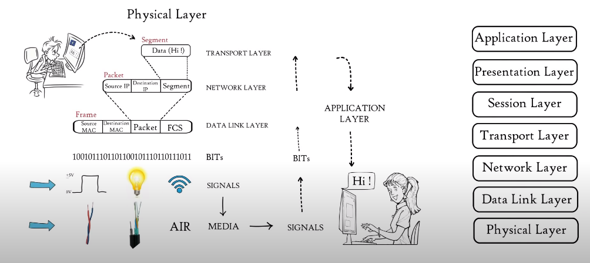

# OSI MODEL :  **Opens Systems Interconnection Model**

To establish a network connection between computers running with the same os can be established with lane cable, but if two computers are running on different os or servers or different architecture of the network. IOS helps in establishing successful connections.
### IOS consists of seven layers and each layer is set of protocol
1. **Application layer**
2. **Presentation Layer**
3. **Session Layer**
4. **Transport Layer**
5. **Network Layer**
6. **Data Link layer**
7. **Physical Layer**

### 1. **Application Layer**

It is used by network applications like chrome, firefox, outlook.  It contains protocols that are required to run chrome, firefox, skype, etc.

A web browser is a network application, it doesn't reside inside the application layer, but it uses network protocol which is required to run it like
- Hypertext Transfer Protocol  (HTTP) :  used for web surf.

-  Hypertext Transfer Protocol Secure (HTTPs) : used for web surf.

- FTP: for file transfer
- NFS: provide a stateless network connection between the client and server
- SMTP : used for email

All the above protocols form the application layer and form the basis for file transfer, web surfing, emails, and virtual terminal.

### 2. **Presentation Layer**

It consists of three process:

- **Translation** 

It receives data from the application layer in the form of characters or numbers, this data is converted into Binary format which is used by machines.

- **Data Compression**

Before data is being transmitted to the encryption, the presentation layer reduces the number of bits that are used to represent data, this reduction is called Data compression.
Due to data compression file size is reduced and at the destination, it can be received easily and faster.

- **Encrytion** / **Decryption**

Before transferring data at the destination, data is encrypted which enhances the security of data then at the receiver side data is being decrypted. SSL protocols provide secure sockets layer

3. ###  **Session layer**

It helps in setting up and managing connections,  enabling data sharing, and followed by termination of connections and sessions.
 it consists of the following process:

 - **Session Management** 

 It takes the help of APIs and NETBIOS to establish a connection with applications running on different computers.

 - **Authentication/Authorization**
  It helps in who you are? and to verify it, the server uses a username and password, once it gets verified a connection or session is established between computer and server. 
  
  - **Authorization**
  After successfully checking for authentication, authorization is checked, it is permission whether you have access to the file or not.

- **Session Management**

Session files keep the track of files, eg suppose a web page contains image and text files, etc, these images and text files are kept at a different location at the server.

 When we request a website in a browser, the browser creates a session or connections to download each of these files separately, these files are received in the form of data packets and sessions layer keep eye on it which data packets belong to which file and stored in the web browser.

4. ### **Transport Layer**

The transport layer controls the reliability of communication through the following ways:
 
- **Segmentation** 
Data received from the session layer is divided into small data units called segments, each segment consists of a source and destination port number and a sequence number. Port number helps to direct to the correct application and sequence number helps in to reassemble in correct order to form correct message at the receiver

- **Flow Control**

Here it controls the amount of data transmitted. Suppose a server transmits data at 100mbps and mobile-only can process at 10Mbps, so the transport layer gives information to the server to reduce transfer speed and adjust accordingly to the receiver and vice-versa. This helps in avoiding data loss.

- **Error Control**
If some data is not reached at the destination, transport helps in automatic repeat requests for missing data. A group of checksum is added to each segment to find out received corrupted segments.

The transport layer uses the following protocol
 **Transmission Control Protocol (TCP)** :  connection-oriented transmission is done by TCP;
eg where full data is must like www, email, FTP, etc.

Due to feedback here lost data can be transmitted. 
 UDP: **User Datagram Protocol (UDP)**: connectionless transmission
eg : 
used for a stream like songs, movies, games, etc
UDP is faster than TCP because it does not provide feedback

5. ### **Network Layer**

 
 It takes the segments from the transport layer and works on received data segments from one computer to another computer at the different network locations.
 Data units in the network layer are called packets. It is the layer where routers reside.
 The function of networks are:

 - **Logical Addressing**: 

 Ip addressing is done in this namely IPv4 and IPv6 
 every computer in the network has a unique IP address, the network layer assigns each segment sender and receiver IP address to form an IP packet.

 - **Routing**: 
 
 is a method to transfer data packets from source to destination based on logical addressing

  - **Path determination**

 the computer can be connected to a server in many ways, choosing the best path from source to destination is called path determination.

6. ### **Data Link Layer**

Data packets are received from the network layer, it contains IP address of receiver and sender.

There are two kinds of addressing 

- **Logical Addressing**:

 It is done on the network layer where data packets contain IP address of both sender and receiver are assigned to segments to form data packets

- **Physical addressing**:

 Data link layer where MAC address of sender and receiver are assigned to data packets to form the frame. MAC is a 12 digit alpha-numeric number embedded in the network interface card in our computer.

The data unit in the data link is called the frame. data link is embedded in the network interface card of our computer and provide means to transfer data from one computer to another computer via local media like copper wire, optical fiber, and air.

Data link layer provides a higher OSI model layer to access the media.
It also controls how data is placed and received from the media.

7. ### **Physical layer**

It converts binary digits into signal  and transmits over local media
it can be an electrical signal in the case of copper wire, the light signal, in the case of optical fiber bulb, and a radio signal in case of air.

At the receiver side, these signals are converted to bits and then passed to data link to form frame, the frame is further decapsulated as data moves high layers, finally data is moved to application layer masks the information of sender in the reiver screen.
### Reference:
#### [@TechTerms](https://www.youtube.com/watch?v=vv4y_uOneC0&t=711s) 

### Contact Page:

 👤 **Rohit Kumar**

- Github: [@rohitkumar61](https://github.com/rohitkumar61)
- Twitter: [@RohitKu72829383](https://twitter.com/RohitKu72829383)
- Linkedin: [Rohit Kumar](https://www.linkedin.com/in/rohit-kumar-9175aa128/)